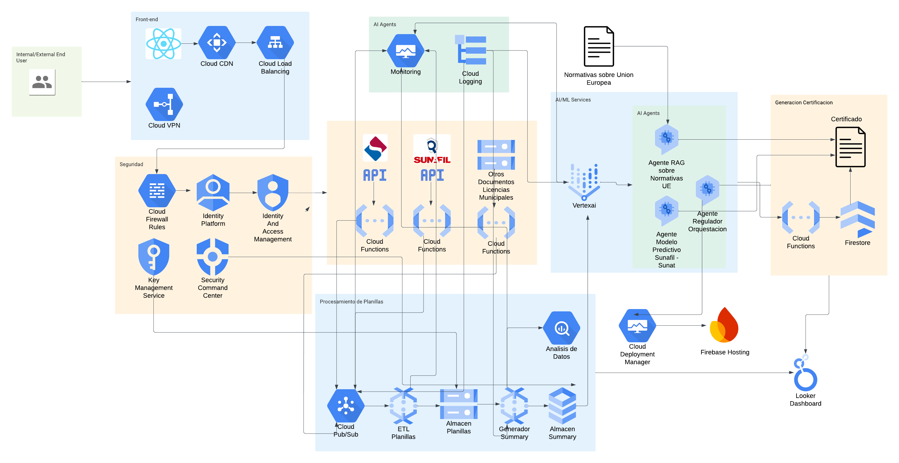

# Sistema de Evaluación de Cumplimiento Normativo con IA

## 🎯 Descripción

EnRegla es un Sistema Inteligente de Cumplimiento Normativo implementado como plataforma web escalable en Google Cloud Platform (GCP), automatizando la verificación y certificación del cumplimiento normativo para empresas exportadoras.

## 🎥 Demo

<p align="center">
  
</p>

## Arquitectura Principal

- Frontend: React + Cloud CDN + Load Balancing
- Backend: Orquestación de agentes IA en Vertex AI
- Procesamiento: Sistema ETL automatizado
- Almacenamiento: Firebase + Firestore
- Monitoreo: Looker Dashboard en tiempo real

## Componentes Tecnológicos

### 1. Capa de Seguridad

- Cloud VPN para acceso corporativo
- Firewall, IAM y KMS para gestión de accesos
- Security Command Center integrado

### 2. Inteligencia Artificial (Vertex AI)

- Agentes especializados:
  - RAG para análisis de normativas
  - Validador Sunafil-Sunat
  - Sistema de recomendaciones

### 3. Procesamiento de Datos

- Cloud Pub/Sub para gestión de eventos
- Pipeline ETL automatizado
- Generador de resúmenes
- Sistema de análisis predictivo

### 4. Integración

- APIs para servicios externos
- Firestore en tiempo real
- Integración con sistemas municipales

## Objetivo

La plataforma automatiza completamente el proceso de certificación para el cumplimiento del Reglamento (UE) 2023/1115, desde la evaluación inicial hasta la emisión de certificados digitales, proporcionando una solución integral de cumplimiento normativo.

## 🏗️ Arquitectura en GCP

<p align="center">
  
</p>

## 🤖 Orquestación Detallada de Agentes IA

La orquestación de agentes se implementa mediante la clase `IntegratedEUComplianceEvaluator`, que es el núcleo central del sistema. Esta clase coordina tres agentes especializados que trabajan en conjunto para proporcionar un análisis integral del cumplimiento normativo de cada empresa.

### 1. Agente AI Predictivo (Data Sunafil-Sunat)

Este agente se encarga del análisis predictivo utilizando datos históricos de Sunafil y Sunat para evaluar el nivel de cumplimiento y riesgo de las empresas.

- **Implementación**: `RobustLightGBM`
  Sistema de clasificación robusto basado en gradient boosting que procesa múltiples indicadores laborales y financieros.

- **Características principales**:
- Modelo LightGBM multiclase con 5 niveles de clasificación
- Sistema de early stopping de 50 rondas para prevenir overfitting
- Métricas duales: multi_logloss para optimización y multi_error para evaluación
- Hiperparámetros optimizados mediante validación cruzada:
  ```python
  params = {
      'objective': 'multiclass',
      'num_class': 5,
      'metric': ['multi_logloss', 'multi_error'],
      'num_leaves': 31,
      'learning_rate': 0.03,
      'feature_fraction': 0.8,
      'bagging_fraction': 0.8,
      'bagging_freq': 5,
      'min_child_samples': 20
  }
  ```
- Features procesadas seleccionadas por importancia y relevancia normativa:
  ```python
  base_features = [
      'risk_score',        # Puntuación de riesgo calculada
      'MONTO_MULTA',       # Monto total de multas históricas
      'numtra',            # Número total de trabajadores
      'costosal',          # Costo salarial total mensual
      'ntrab_consctr',     # Trabajadores con contrato formal
      'risk_ratio',        # Ratio de riesgo normalizado
      'worker_density',    # Densidad laboral por costo
      'safety_index'       # Índice de seguridad laboral
  ]
  ```
- Variables derivadas para análisis profundo:
  ```python
  derived_metrics = {
      'risk_ratio': 'MONTO_MULTA / numtra',           # Multa promedio por trabajador
      'worker_density': 'numtra / costosal',          # Eficiencia del costo laboral
      'safety_index': 'ntrab_consctr / numtra',       # Ratio de formalidad laboral
      'compliance_score': '100 - (risk_score * 10)'   # Score de cumplimiento
  }
  ```
- Rangos de evaluación para clasificación por estrellas:
  ```python
  score_ranges = {
      '1 estrella': 'compliance_score <= 65',    # Alto riesgo
      '2 estrellas': '65 < compliance_score <= 75',  # Riesgo moderado
      '3 estrellas': '75 < compliance_score <= 85',  # Cumplimiento básico
      '4 estrellas': '85 < compliance_score <= 95',  # Buen cumplimiento
      '5 estrellas': 'compliance_score > 95'     # Excelente cumplimiento
  }
  ```

### 2. Agente AI RAG para Normativas UE

Este agente especializado procesa y analiza las normativas de la UE utilizando técnicas avanzadas de recuperación y generación aumentada (RAG).

- **Implementación**: `EUComplianceRAG`
- **Componentes y proceso**:
- Procesamiento inicial del texto normativo:
  - RecursiveCharacterTextSplitter con chunk size de 1000 tokens
  - Overlap de 200 tokens para mantener contexto entre fragmentos
- Sistema de embeddings de OpenAI para vectorización
- Almacenamiento vectorial FAISS para búsqueda eficiente
- LLM GPT-4 con temperatura 0 para máxima precisión
- Sistema de recuperación basado en similitud semántica
- Análisis contextual profundo de cumplimiento normativo

### 3. Agente AI RAG para Recomendaciones

Agente dedicado a la generación de recomendaciones personalizadas basadas en el análisis integral.

- **Implementación**: `RecommendationAgent`
- **Características y funcionamiento**:
- Modelo base GPT-4-turbo-preview para máxima capacidad de contextualización
- Temperatura 0.7 calibrada para balance entre creatividad y precisión
- Sistema de integración multifuente:
  - Incorporación de análisis de cumplimiento histórico
  - Procesamiento de métricas actuales de la empresa
  - Evaluación del estado de cumplimiento actual
- Generación de 3-5 recomendaciones accionables y específicas

### Integración y Flujo de Datos

El sistema integra los resultados de los tres agentes en un formato estructurado:

```python
evaluation = {
   'empresa_id': company['ID_EMPRESA'],
   'estrellas': star_rating,
   'evaluacion': {
       'nivel_riesgo': risk_level,
       'estado_cumplimiento': compliance_status,
       'codigo_color': color_code,
       'analisis_normativo': compliance_analysis['analysis'],
       'metricas_clave': {
           'score_riesgo': round(risk_score, 2),
           'proporcion_indefinidos': round(company.get('prop_indefinidos', 0), 2),
           'tiempo_operacion': f"{int(company.get('Tiempo_E_anio', 0))} años",
           'indice_seguridad': safety_index
       }
   },
   'recomendaciones': recommendations,
   'fuentes_normativas': compliance_analysis.get('sources', [])
}

```

## 📊 Resultados del Sistema

<div align="center">
  
  
</div>
